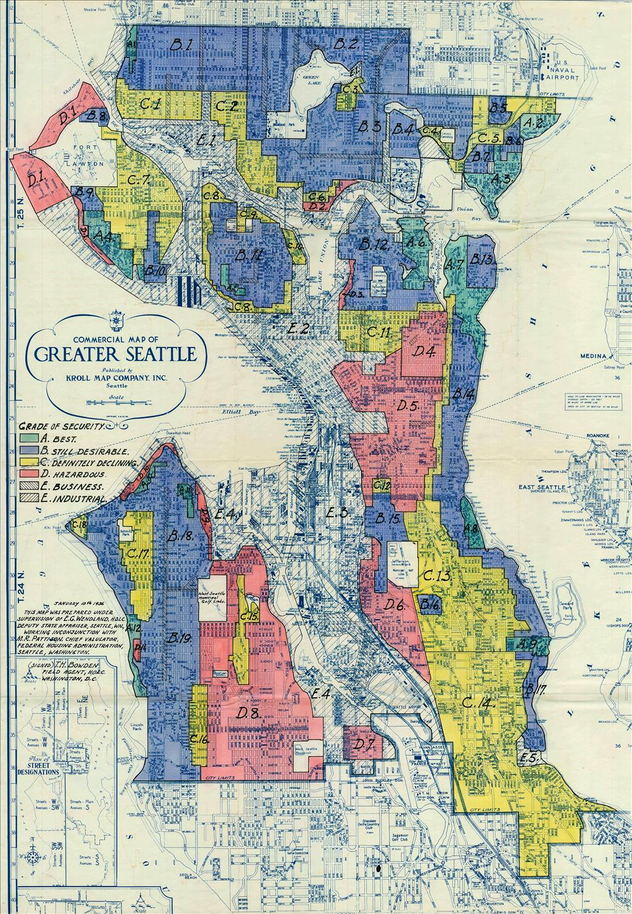
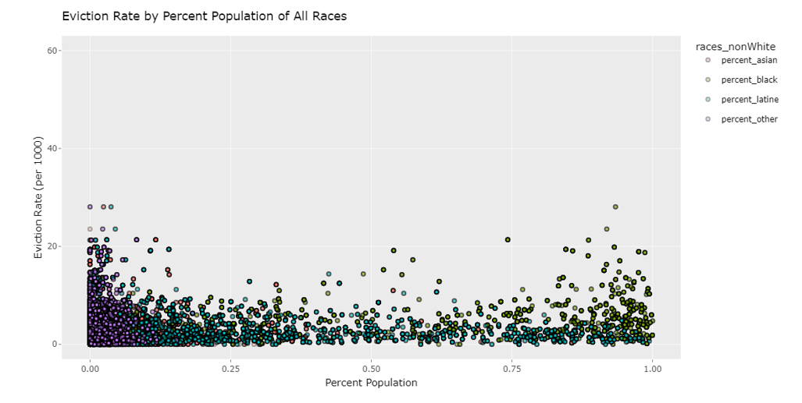

```{r include=FALSE, message=FALSE, warning=FALSE}
library(httr)
library(jsonlite)
library(sf)
library(tidyverse)
library(car)
library(plotly)
library(leaps)
library(GGally)
library(reshape2)
library(gridExtra)
library(grid)

my_map_theme <- function(){
  theme(panel.background=element_blank(),
        axis.text=element_blank(),
        axis.ticks=element_blank(),
        axis.title=element_blank())
}

```

```{r echo=FALSE, message=FALSE, warning=FALSE}
# Load data
chicago <- st_read("../data/chicago_erap_red_evic.geojson", quiet=TRUE)
# Handle missing values by removing rows with NAs
chicago_clean <- chicago |>
  filter(!is.na(eviction_rate) & 
           !is.na(percent_cost_burdened_renters) & 
           !is.na(median.gross.rent) & 
           !is.na(percent_black) & 
           !is.na(percent_asian) & 
           !is.na(percent_latine) & 
           !is.na(percent_other) & 
           !is.na(index_value) & 
           !is.na(year) & 
           !is.na(county_name))
```

```{r echo=FALSE, message=FALSE, warning=FALSE}

# Plot 1: Scatter Plot of Eviction Rate by Percent Black Population
plot1 <- ggplot(chicago_clean, aes(x = percent_black, y = eviction_rate)) +
  geom_point(color = "black", alpha = 0.35, shape = 21, stroke = 0.5, fill = "#38EB37" ) +
  labs(title = "Eviction Rate by Percent Black Population", x = "Percent Black Population", y = "Eviction Rate per 1000") +
  scale_x_continuous(limits = c(0, 1)) +
  geom_smooth(method = "lm",formula = 'y ~ x', color = "blue") +
  theme(plot.title = element_text(size = 10), 
        axis.title = element_text(size = 10), 
        axis.text = element_text(size = 8))

# Plot 2: Scatter Plot of Eviction Rate by Percent Asian Population
plot2 <- ggplot(chicago_clean, aes(x = percent_asian, y = eviction_rate)) +
  geom_point(color = "black", alpha = 0.35, shape = 21, stroke = 0.5, fill = "#E7507C" ) +
  labs(title = "Eviction Rate by Percent Asian Population", x = "Percent Asian Population", y = "Eviction Rate per 1000") +
  scale_x_continuous(limits = c(0, 1)) +
  geom_smooth(method = "lm",formula = 'y ~ x', color = "blue") +
  theme(plot.title = element_text(size = 10), 
        axis.title = element_text(size = 10), 
        axis.text = element_text(size = 8))


# Plot 3: Scatter Plot of Eviction Rate by Percent Latine Population
plot3 <- ggplot(chicago_clean, aes(x = percent_latine, y = eviction_rate)) +
  geom_point(color = "black", alpha = 0.35, shape = 21, stroke = 0.5, fill = "#1ECCC4" ) +
  labs(title = "Eviction Rate by Percent Latine Population", x = "Percent Latine Population", y = "Eviction Rate per 1000") +
  scale_x_continuous(limits = c(0, 1)) +
  geom_smooth(method = "lm",formula = 'y ~ x', color = "blue") +
  theme(plot.title = element_text(size = 10), 
        axis.title = element_text(size = 10), 
        axis.text = element_text(size = 8))


# Plot 4: Scatter Plot of Eviction Rate by Percent Other Population
plot4 <- ggplot(chicago_clean, aes(x = percent_other, y = eviction_rate)) +
  geom_point(color = "black", alpha = 0.35, shape = 21, stroke = 0.5, fill = "#C12FB3" ) +
  labs(title = "Eviction Rate by Percent Other Population", x = "Percent Other Population", y = "Eviction Rate per 1000") +
  scale_x_continuous(limits = c(0, 1)) +
  geom_smooth(method = "lm",formula = 'y ~ x', color = "blue") +
  theme(plot.title = element_text(size = 10), 
        axis.title = element_text(size = 10), 
        axis.text = element_text(size = 8))


# Plot 5: Bar Plot of Eviction Rate by Grade
plot5 <- ggplot(chicago_clean, aes(x = grade, y = eviction_rate, fill = grade)) +
  geom_bar(stat = "identity") +
  labs(title = "Eviction Rate by Grade", x = "Grade", y = "Eviction Rate")

# Plot 6: Histogram of Eviction Rate
plot6 <- ggplot(chicago_clean, aes(x = eviction_rate)) +
  geom_histogram(binwidth = 1, fill = "blue", color = "black") +
  labs(title = "Histogram of Eviction Rate", x = "Eviction Rate", y = "Frequency")

# Plot 7: Density Plot of Eviction Rate
plot7 <- ggplot(chicago_clean, aes(x = eviction_rate, fill = grade)) +
  geom_density(alpha = 0.5) +
  labs(title = "Density Plot of Eviction Rate by Grade", x = "Eviction Rate", y = "Density")+
  theme(plot.title = element_text(size = 10), 
        axis.title = element_text(size = 10), 
        axis.text = element_text(size = 8))


# Plot 8: Scatter Plot of Eviction Rate by ERAP Index Value
plot8 <- ggplot(chicago_clean, aes(x = index_value, y = eviction_rate)) +
  geom_point(color = "black", alpha = 0.35, shape = 21, stroke = 0.5, fill = "#EBDC49" ) +
  labs(title = "Eviction Rate by ERAP Index Value", x = "ERAP Index Value", y = "Eviction Rate")+
  geom_smooth(method = "lm",formula = 'y ~ x', color = "blue") +
  theme(plot.title = element_text(size = 10), 
        axis.title = element_text(size = 10), 
        axis.text = element_text(size = 8))

# Plot 9: Scatter Plot of Eviction Rate by Median Gross Rent
plot9 <- ggplot(chicago_clean, aes(x = median.gross.rent, y = eviction_rate)) +
  geom_point(color = "black", alpha = 0.35, shape = 21, stroke = 0.5, fill = "#EBDC49" ) +
  labs(title = "Eviction Rate by Median Gross Rent", x = "Median Gross Rent", y = "Eviction Rate") +
  geom_smooth(method = "lm",formula = 'y ~ x', color = "blue") +
  theme(plot.title = element_text(size = 10), 
        axis.title = element_text(size = 10), 
        axis.text = element_text(size = 8))
```

## Abstract: 

While looking at the ERAP index 2.0 data set that is used to predict the need for emergency rental assistance across the United States, we realized it is not a great predictor of actual evictions unless used in conjunction with actual regional data. We also wondered if the ERAP index’s indicators were the best way to account for evictions at a more regional level rather than countrywide. We then looked at the individual indicators to see what they could tell us about evictions rather than the singular ERAP index value.  By combining ERAP data with Eviction Lab data, we were also able to create another better model to predict evictions statewide.

Historical redlining is a discriminatory practice from the 1940s that determines if people should be able to rent housing in an area and put areas into 5 grades. We wanted to see if this practice still affected society today, so we compared the grades to ERAP and eviction data. This showed that while it is not as much of an effect today, there is still existing systemic inequality in housing and economic conditions, with Grade D areas facing higher rates of housing instability and economic vulnerability, while Grade A areas continue to benefit from higher property values and rents.


## Introduction:

### Questions:

1. What can we learn from the ERAP indicators by themselves and can we make ERAP better with eviction data?

2. How do the areas in need of rental assistance and the populations of people living there relate to historical redlining maps?


The ERAP index was made to be used to predict the priority of the need for rental assistance over the entire United States. Through their analysis and ground testing of their index, they found it is not a predictor reliable enough to decide who gets rental assistance without region-specific data. In this project, we looked into each indicator used in the ERAP index with actual eviction data to see if there was more insight to be gained than just from the singular ERAP index value, and made a new model of eviction rate using region-specific data and the ERAP index. 

We also looked into the Modern effect of Redlining. Redlining is a discriminatory practice that began in the United States in the 1930s, where banks and insurance companies refused or limited loans, mortgages, and insurance to specific geographic areas, predominantly those inhabited by African Americans and other minority groups. The term comes from the red ink used to mark areas deemed too risky for investment on maps. Originating from policies by the Home Owners' Loan Corporation (HOLC) and the Federal Housing Administration (FHA), redlining involved ranking areas from "A" (best) to "D" (hazardous), with minority neighborhoods often designated as "D." This practice led to significant racial segregation and economic disparities, restricting homeownership and wealth accumulation in minority communities. Despite the Fair Housing Act of 1968, which aimed to eliminate housing discrimination, the effects of redlining persist, contributing to disparities in homeownership rates, wealth gaps, and neighborhood conditions between white and minority populations. (Mapping inequality: Redlining in New Deal America) Now, with eviction lab data and the ERAP index, we analyzed whether redlining still affects housing today and, if so, how. 

Redlining in 1940 can first be looked at in relation to Seattle with a historical image of the map shown below. 


## Methods:

We found three data sets that we are evaluating. We also used one data set to merge the redlining data with the tract ERAP data. 
The first is a data set from the ERAP index 2.0, which consists of three subsets to predict evictions for priority rental assistance. 

The ERAP index 2.0 got data from the American Community Survey’s 2017-2021 five-year estimates and the US Department of Housing and Urban Development’s Comprehensive Housing Affordability Strategy 2015-2019 (CHAS) dataset.
The American Community Survey gets its five-year estimates by combining the results of five previous survey years into a pooled data frame. The ACS is a continuous survey that sends questionnaires to a sample of housing units each month, with roughly 3.5 million addresses surveyed annually. Because it is a sample rather than the whole population, there is some degree of sampling error, but because it is over five years of data the sample size is larger and has less room for error. Addresses are randomly selected through a process of scientific sampling, and people cannot be removed from the list. They then use any method possible to send the survey to people from mail to email to online. It is done by the National Census Bureau.

The US Department of Housing and Urban Development’s Comprehensive Housing Affordability Strategy (CHAS) dataset is made using the information from the ACS dataset but is more detailed information down to the geographic levels like census tracts. It is basically a specialized subset of the ACS data set. 

All of this data is then organized into three subsets of information, turned into percentages and then put into z-scores which are weighted against each other. To estimate the weights of each subindex, they used a weighted quantile sums (WQS) regression model, which was implemented using the gWQS R package (Renzetti et al. 2022). In Table 2 you can see where each indicator for the subsets data came from as well as each indicators association with eviction filing rates from 2018 at the national level. 

<https://datacatalog.urban.org/dataset/emergency-rental-assistance-priority-index-20>

The second data set is the Eviction Lab data set. The Eviction Lab data set is created with the Eviction Tracking System(ETS) which compiles eviction data from local county court systems and other sources where eviction records are publicly accessible. The dataset focuses on eviction filings, outcomes, and demographics of those affected. It tracks evictions in real-time across selected cities and states, analyzing trends and identifying hotspots. The data collected includes eviction filing counts, rates, trends over time, and demographic disparities, helping to monitor and respond to the eviction crisis effectively.

<https://evictionlab.org/eviction-tracking/>

The third data set is the Redlining data set. The Redlining dataset from the Mapping Inequality project is gathered by digitizing and georeferencing historical maps and documents from the Home Owners' Loan Corporation (HOLC) from the 1930s. These maps and accompanying area descriptions were created to assess the risk of real estate investments, often discriminating against minority neighborhoods. The scans of maps and area descriptions are all from City Survey Files, 1935-1940 at the National Archives with two exceptions. The San Antonio map is from the University of Texas, San Antonio Special Collections and the Portland, Maine, map from Bowdoin College. The georectified rasters and spatial data are available under a CC-BY-NC license and were used to overlay the images. 

<https://dsl.richmond.edu/panorama/redlining/data>

The fourth data set is the crosswalk data set, which combined the ERAP data set with the redlining data set by tract. Data from the ERAP data set and the Redlining datasets were combined using tract-crosswalk through GEOID and FIPS code because the numbers mean the same thing. The same was done for ERAP and Eviction Lab data. Figures were made with the built-in geometries from the data sets or by graphing some of the variables through R. 

<https://github.com/americanpanorama/mapping-inequality-census-crosswalk>

The datasets that we merged and created to use in our files can all be found in the main branch of our GitHub repository in the data folder.

<https://github.com/mclemmer7/Evictions-and-Redlining/tree/main/data>

### Analyzing Current Indicators used in the ERAP index:

We looked at each indicator of the ERAP index with Eviction data to look at insights that can’t be seen just from the singular ERAP index value. We first took variables from the ERAP data set, such as (percent Black) and combined it with the eviction lab data for how many people with that variable got evicted through visualizations. We also merged it with the redlining data set to get a preliminary look at what effects redlining grades might have in today's society.

### The creation of a new model for evictions:

The new models for the states were made by combining the “wa_eviction_erap_tracts.geojson” dataset from the Urban Institute ERAP data and the Washington Eviction Lab legacy tract data. To get this model, almost all of the predictors in the dataset in an initial model were included, excluding the ERAPindex value because we wanted to improve the ERAPindex and create a better version, rather than building off of it directly. The racial data was also excluded since it is not useful in predicting evictions. We know this because whenever the racial data was in (percent minority), it did not affect the model at all. Then backward selection was used in order to find the model with the best AIC value out of all the initial predictors. This left a model containing nine predictors. Next, looking at the summary for the model, num_eli_renters was not a statistically significant predictor. It was removed and an anova test was performed, getting a p-value of  0.07004. This shows that num_eli_renters does not provide a statistically significant improvement to the model since the p-value is below the significance level of 0.05. Next, renter.occupied.households was not a significant predictor, so another anova test was performed. The simplified model is better since the analysis of variance calculated a p-value of 0.0511, showing that the model with the renter occupied households does not provide a statistically significant improvement over the model without that predictor. This left a model that has seven predictors, and all of them are significant. 

### New Variables:

In the ERAP redlining data sets, we made the percentage of minorities variable by combining the percent Latin, Black, and Asian variables leaving out the percent native american. We then took this decimal representation of the minority, which is out of 1, and made it out of 100 for easier to understand statistical data. We did the same for the percent cost burden though we did not have to create the original variable.

The eviction_rate variable was created using evictions per 1000 people for each census tract. We needed a new eviction rate because the one originally included in the Eviction Lab data did not specify how the rate was calculated.

### Key Statistical Analyses:

After the ERAP data was merged with the Eviction Lab data, we made a linear model with the ERAP index as the only predictor of eviction rate to see how useful the ERAP index is for predicting actual evictions rather than people in need of rental assistance. We used a summary of the model to see the p-value of the ERAP index as a predictor and also to see the adjusted $R^2$ value of the model to see how much variance in eviction rates is explained by the model.

The ERAP index was calculated with a weight of all of the variables in the Urban Institute dataset, so we took those variables along with variables from the Eviction Lab data to create a new model for Washington state evictions. The variables used from the ERAP data are the income subindex value, household characteristics subindex value, and percent of renter occupied units. These subindex values were calculated by the Urban Institute by creating Z scores of the data for each indicator and then combining them into each subindex value. The variables used from the Eviction Lab data are the poverty rate, median gross rent, median household income, and median property value. This is a total of seven indicators that were used for the new model. This was then also done for Pennsylvania, Ohio, and Illinois. This was to determine if by combining ERAP with regional data, could we predict evictions better. We then performed an analysis of variance between the two models using the anova command.The data for each model had a different number of rows, so a subset of matching data had to be used for the comparison.

We also created some linear models for redlining. One was predicting the current percent minority in an area based on HOC Redlining grade and the other was predicting the ERAP value. These linear models follow the same thinking as stated above for ERAP data being merged with eviction lab data. 


## Results:

### ERAP Analysis of Indicators:


```{r echo=FALSE, message=FALSE, warning=FALSE}
# Arrange the first set of plots in a grid
grid.arrange(
  arrangeGrob(
    grobs = list(plot1, plot2, plot3, plot4), 
    ncol = 2
  ),
  top = textGrob("Chicago Graphs", gp = gpar(fontsize = 20, font = 2))
)
```


These first plots are of the racial indicators used in the ERAP index 2.0, specifically in Chicago. The scatter plot shows that areas with a higher percentage of the Black population tend to have higher eviction rates, but the overall range is lower than other demographics. Also, the data points are mostly clustered at lower percentages of the Asian population, with a few outliers showing higher eviction rates. Most data points cluster at low Latine population percentages, with a few outliers showing slightly higher eviction rates. High eviction rates are concentrated in areas with a low percentage of the "Other" population.

```{r echo=FALSE, message=FALSE, warning=FALSE}
# Arrange the second set of plots in a grid
grid.arrange(
  arrangeGrob(
    grobs = list(plot5, plot6, plot7, plot8, plot9), 
    ncol = 2
  )
)

```



This second set of plots is from economic and grading factor indicators. Areas with grade C and D have significantly higher eviction rates compared to grades A and B. The histogram shows most areas have lower eviction rates, but there are notable instances of higher eviction rates. Grade A areas have a high density of low eviction rates, while grades C and D show a wider spread with higher eviction rates. Higher ERAP index values correlate with a wider range of eviction rates, with some areas experiencing high eviction rates despite high ERAP support. Eviction rates across various rent values are broader, suggesting that rent alone is not a definitive predictor of eviction rates. Higher eviction rates tend to cluster in areas with low percentages of minority populations.

### Eviction Lab vs ERAP data results:

$$
\begin{aligned}
\widehat{\text{eviction_rate}} = & \ -1.194 + 0.006423 \cdot \text{income_subindex_value} - 0.005748 \cdot \text{hh_chars_subindex_value} \\
  & \ + 5.138 \cdot \text{percent_renter_occ_units} + 0.06893 \cdot \text{poverty.rate} + 0.000697 \cdot \text{median.gross.rent} \\ 
  & \ + 0.00001356 \cdot \text{median.household.income} - 0.000004625 \cdot \text{median.property.value}
\end{aligned}
$$
The ERAP index value is a statistically significant predictor for eviction rate when we look at its p-value, however the adjusted $R^2$ value for the model is fairly low, with our model explaining 22.7% of the variation in eviction rate. Because this value is so low, we wanted to make a better model for predicting eviction rate, by using more predictors in the model. Our model has an adjusted $R^2$ value of 33.75%, which is an improvement from the model with the ERAP index as the only predictor.


Comparing our model to the model using the ERAP index value as the only predictor of eviction rate, the analysis of the variance table shows that there is a p-value of less than 2.2e-16 for our model. This shows that we can reject the null hypothesis that our model does not add anything useful to the ERAP index value model because the p-value is so small. We have sufficient evidence that our model is better than using the ERAP index model. This model was then used to create the images below which have the new data indicators for each state.

### New Model for Washington, Pennsylvania, Ohio, and Illinois:

```{r echo=FALSE, message=FALSE, warning=FALSE}
wa_eviction_erap_tracts <- st_read("../data/wa_eviction_erap_tracts.geojson", quiet=TRUE)
wa_eviction_erap_tracts$text <- paste("<b>Tract", wa_eviction_erap_tracts$census_tract, "of", wa_eviction_erap_tracts$county_name,
              "<b><br>ERAP Index:", wa_eviction_erap_tracts$index_value,
              "<br>Eviction Rate:",round( wa_eviction_erap_tracts$eviction_rate,3),
              "<br>Population:", wa_eviction_erap_tracts$population,
              "<br>Poverty Rate:", wa_eviction_erap_tracts$poverty.rate)


wa_map <- ggplot(wa_eviction_erap_tracts) +
  geom_sf(aes(fill = index_value, text = text)) +
  scale_fill_continuous("ERAP Index Value",
                        low="yellow",
                        high="red") +
  my_map_theme() +
  ggtitle("Evictions and ERAP Index by census tract in Washington")


ggplotly(wa_map, tooltip = "text") |>
  style(hoveron = "fills+points")
```

```{r echo=FALSE, message=FALSE, warning=FALSE}
# Now Illinois
il_eviction_erap_tracts <- st_read("../data/il_eviction_erap_tracts.geojson", quiet=TRUE)
il_eviction_erap_tracts$text <- paste("<b>Tract", il_eviction_erap_tracts$census_tract, "of", il_eviction_erap_tracts$county_name,
              "<b><br>ERAP Index:", il_eviction_erap_tracts$index_value,
              "<br>Eviction Rate:",round( il_eviction_erap_tracts$eviction_rate,3),
              "<br>Population:", il_eviction_erap_tracts$population,
              "<br>Poverty Rate:", il_eviction_erap_tracts$poverty.rate)

il_map <- ggplot(il_eviction_erap_tracts) +
  geom_sf(aes(fill = index_value, text = text)) +
  scale_fill_continuous("ERAP Index Value",
                        low="yellow",
                        high="red") +
  my_map_theme() +
  ggtitle("Evictions and ERAP Index by census tract in Illinois")


ggplotly(il_map, tooltip = "text") |>
  style(hoveron = "fills+points")
```

```{r echo=FALSE, message=FALSE, warning=FALSE}
# Now Ohio
oh_eviction_erap_tracts <- st_read("../data/oh_eviction_erap_tracts.geojson", quiet=TRUE)
oh_eviction_erap_tracts$text <- paste("<b>Tract", oh_eviction_erap_tracts$census_tract, "of", oh_eviction_erap_tracts$county_name,
              "<b><br>ERAP Index:", oh_eviction_erap_tracts$index_value,
              "<br>Eviction Rate:",round( oh_eviction_erap_tracts$eviction_rate,3),
              "<br>Population:", oh_eviction_erap_tracts$population,
              "<br>Poverty Rate:", oh_eviction_erap_tracts$poverty.rate)

oh_map <- ggplot(oh_eviction_erap_tracts) +
  geom_sf(aes(fill = index_value, text = text)) +
  scale_fill_continuous("ERAP Index Value",
                        low="yellow",
                        high="red") +
  my_map_theme() +
  ggtitle("Evictions and ERAP Index by census tract in Ohio")


ggplotly(oh_map, tooltip = "text") |>
  style(hoveron = "fills+points")
```

```{r echo=FALSE, message=FALSE, warning=FALSE}
# Map Pennsylvania
pa_eviction_erap_tracts <- st_read("../data/pa_eviction_erap_tracts.geojson", quiet=TRUE)
pa_eviction_erap_tracts$text <- paste("<b>Tract", pa_eviction_erap_tracts$census_tract, "of", pa_eviction_erap_tracts$county_name,
              "<b><br>ERAP Index:", pa_eviction_erap_tracts$index_value,
              "<br>Eviction Rate:",round( pa_eviction_erap_tracts$eviction_rate,3),
              "<br>Population:", pa_eviction_erap_tracts$population,
              "<br>Poverty Rate:", pa_eviction_erap_tracts$poverty.rate)

pa_map <- ggplot(pa_eviction_erap_tracts) +
  geom_sf(aes(fill = index_value, text = text)) +
  scale_fill_continuous("ERAP Index Value",
                        low="yellow",
                        high="red") +
  my_map_theme() +
  ggtitle("Evictions and ERAP Index by census tract in Pennsylvania")


ggplotly(pa_map, tooltip = "text") |>
  style(hoveron = "fills+points")
```

These new images of the states predict eviction rates in each area at a rate of evictions per 1000 people. Then when looking at the ERAP index the eviction rate matches up for some of the sections, however not all. Also poverty rate seems to match up more with ERAP index than eviction rate.

### Analysis of Redlining Effects in Four Cities:

```{r echo=FALSE, message=FALSE, warning=FALSE}

Cleveland__erap_redlining_dataset <- st_read("../data/Cleveland_erap_redlining.geojson", quiet=TRUE)

Seattle_erap_redlining_dataset <- st_read("../data/Seattle_erap_redlining.geojson", quiet=TRUE)

Pittsburgh_erap_redlining_dataset <- st_read("../data/Pittsburgh_erap_redlining.geojson", quiet=TRUE)

Chicago_erap_redlining_dataset <- st_read("../data/Chicago_erap_redlining.geojson", quiet=TRUE)

Chicago_erap_redlining_dataset <-Chicago_erap_redlining_dataset%>%
  mutate(grade = ifelse(is.na(grade), "E", grade))
```

```{r echo=FALSE, message=FALSE, warning=FALSE}

Sea_map2 <-ggplot(width = 30, height = 15) +
  geom_sf(data = Seattle_erap_redlining_dataset, aes(fill = grade, 
                                      text = paste("Grade", grade, ":", cat, "<br>",
                                                   "Percent Minority:", percent_minority_pct, "%", "<br>", "<br>",
                                                   ifelse(grade != "E", paste("Label:", label, "<br>"), ""),
                                                   "ERAP Value:", index_value, "<br>",
                                                   "Median Monthly Cost: $", median_monthly_housing_cost, "<br>",
                                                   "Cost Burdened Renters:", percent_cost_burdened_renters_pct, "%"))) +
  scale_fill_manual(values = c("A" = "mediumseagreen", "B" = "dodgerblue3", "C" = "khaki1", "D" = "indianred", "E" = "gray48"),
                    labels = c("A. Best", "B. Still Desirable", "C. Definitely Declining", "D. Hazardous", "E. Industrial/Business"),
                    name = "Grade of Security") + 
  theme_minimal() +
  theme(panel.background = element_blank(),
        panel.grid = element_blank(),
        axis.text = element_blank(),
        axis.ticks = element_blank(),
        plot.title = element_text(family = "Times New Roman", size = 15)) +  
  labs(title = "<b>Redlining Map: <span style='font-size: larger;'>Seattle</span></b>")


Sea_map2_plotly <- ggplotly(Sea_map2, tooltip = "text")
Sea_map2_plotly 

```

```{r echo=FALSE, message=FALSE, warning=FALSE}
seattle_erap_red_evic <- st_read("../data/seattle_erap_red_evic.geojson", quiet=TRUE)
seattle_erap_red_evic$text <- paste("<b>Tract", seattle_erap_red_evic$census_tract,
              "<b><br>ERAP Index:", seattle_erap_red_evic$index_value,
              "<br>Eviction Rate:",round(seattle_erap_red_evic$eviction_rate,3),
              "<br>Grade", seattle_erap_red_evic$grade, ":", seattle_erap_red_evic$cat,
              "<br>Population:", seattle_erap_red_evic$population,
              "<br>Poverty Rate:", seattle_erap_red_evic$poverty.rate)

seattle_map <- ggplot(seattle_erap_red_evic) +
  geom_sf(aes(fill = eviction_rate, text = text)) +
  scale_fill_continuous("Eviction Rate",
                        low="yellow",
                        high="red") +
  my_map_theme() +
  ggtitle("Evictions by census tract in Seattle")


ggplotly(seattle_map, tooltip = "text") |>
  style(hoveron = "fills+points")
```


```{r echo=FALSE, message=FALSE, warning=FALSE}


Chicago_red_map1 <- ggplot(width = 30, height = 15) +
  geom_sf(data = Chicago_erap_redlining_dataset, aes(fill = grade, 
                                      text =paste("Grade", grade, ":", cat, "<br>",
                                                   "Percent Minority:", percent_minority_pct, "%", "<br>", "<br>",
                                                   ifelse(grade != "E", paste("Label:", label, "<br>"), ""),
                                                   "ERAP Value:", index_value, "<br>",
                                                   "Median Monthly Cost: $", median_monthly_housing_cost, "<br>",
                                                   "Cost Burdened Renters:", percent_cost_burdened_renters_pct, "%"))) +
  scale_fill_manual(values = c("A" = "mediumseagreen", "B" = "dodgerblue3", "C" = "khaki1", "D" = "indianred", "E" = "gray48"),
                    labels = c("A. Best", "B. Still Desirable", "C. Definitely Declining", "D. Hazardous", "E. Industrial/Business"),
                    name = "Grade of Security") + 
  theme_minimal() +
  theme(panel.background = element_blank(),
        panel.grid = element_blank(),
        axis.text = element_blank(),
        axis.ticks = element_blank(),
        plot.title = element_text(family = "Times New Roman", size = 15)) +  
  labs(title = "<b>Redlining Map: <span style='font-size: larger;'>Chicago</span></b>")


Chicago_map_plotly <- ggplotly(Chicago_red_map1, tooltip = "text")


Chicago_map_plotly


```

```{r echo=FALSE, message=FALSE, warning=FALSE}
chicago_erap_red_evic <- st_read("../data/chicago_erap_red_evic.geojson", quiet=TRUE)
chicago_erap_red_evic$text <- paste("<b>Tract", chicago_erap_red_evic$census_tract,
              "<b><br>ERAP Index:", chicago_erap_red_evic$index_value,
              "<br>Eviction Rate:",round( chicago_erap_red_evic$eviction_rate,3),
              "<br>Grade", chicago_erap_red_evic$grade, ":", chicago_erap_red_evic$cat,
              "<br>Population:", chicago_erap_red_evic$population,
              "<br>Poverty Rate:", chicago_erap_red_evic$poverty.rate)

chicago_map <- ggplot(chicago_erap_red_evic) +
  geom_sf(aes(fill = eviction_rate, text = text)) +
  scale_fill_continuous("Eviction Rate",
                        low="yellow",
                        high="red") +
  my_map_theme() +
  ggtitle("Evictions by census tract in Chicago")


ggplotly(chicago_map, tooltip = "text") |>
  style(hoveron = "fills+points")
```

```{r echo=FALSE, message=FALSE, warning=FALSE}

Pitts_map1 <- ggplot(width = 30, height = 15) +
  geom_sf(data = Pittsburgh_erap_redlining_dataset, aes(fill = grade, 
                                      text = paste("Grade", grade, ":", cat, "<br>",
                                                   "Percent Minority:", percent_minority_pct, "%", "<br>", "<br>",
                                                   ifelse(grade != "E", paste("Label:", label, "<br>"), ""),
                                                   "ERAP Value:", index_value, "<br>",
                                                   "Median Monthly Cost: $", median_monthly_housing_cost, "<br>",
                                                   "Cost Burdened Renters:", percent_cost_burdened_renters_pct, "%"))) +
  scale_fill_manual(values = c("A" = "mediumseagreen", "B" = "dodgerblue3", "C" = "khaki1", "D" = "indianred", "E" = "gray48"),
                    labels = c("A. Best", "B. Still Desirable", "C. Definitely Declining", "D. Hazardous", "E. Industrial/Business"),
                    name = "Grade of Security") + 
  theme_minimal() +
  theme(panel.background = element_blank(),
        panel.grid = element_blank(),
        axis.text = element_blank(),
        axis.ticks = element_blank(),
        plot.title = element_text(family = "Times New Roman", size = 15)) +  
  labs(title = "<b>Redlining Map: <span style='font-size: larger;'>Pittsburgh</span></b>")


Pitts_map1_plotly <- ggplotly(Pitts_map1 , tooltip = "text")

Pitts_map1_plotly

```

```{r echo=FALSE, message=FALSE, warning=FALSE}
pittsburgh_erap_red_evic <- st_read("../data/pittsburgh_erap_red_evic.geojson", quiet=TRUE)
pittsburgh_erap_red_evic$text <- paste("<b>Tract", pittsburgh_erap_red_evic$census_tract,
              "<b><br>ERAP Index:", pittsburgh_erap_red_evic$index_value,
              "<br>Eviction Rate:",round( pittsburgh_erap_red_evic$eviction_rate,3),
              "<br>Grade", pittsburgh_erap_red_evic$grade, ":", pittsburgh_erap_red_evic$cat,
              "<br>Population:", pittsburgh_erap_red_evic$population,
              "<br>Poverty Rate:", pittsburgh_erap_red_evic$poverty.rate)

pittsburgh_map <- ggplot(pittsburgh_erap_red_evic) +
  geom_sf(aes(fill = eviction_rate, text = text)) +
  scale_fill_continuous("Eviction Rate",
                        low="yellow",
                        high="red") +
  my_map_theme() +
  ggtitle("Evictions by census tract in Pittsburgh")


ggplotly(pittsburgh_map, tooltip = "text") |>
  style(hoveron = "fills+points")
```

```{r echo=FALSE, message=FALSE, warning=FALSE}

Clev_2red_map <- ggplot(width = 30, height = 15) +
  geom_sf(data = Cleveland__erap_redlining_dataset, aes(fill = grade, 
                                      text =paste("Grade", grade, ":", cat, "<br>",
                                                   "Percent Minority:", percent_minority_pct, "%", "<br>", "<br>",
                                                   ifelse(grade != "E", paste("Label:", label, "<br>"), ""),
                                                   "ERAP Value:", index_value, "<br>",
                                                   "Median Monthly Cost: $", median_monthly_housing_cost, "<br>",
                                                   "Cost Burdened Renters:", percent_cost_burdened_renters_pct, "%"))) +
  scale_fill_manual(values = c("A" = "mediumseagreen", "B" = "dodgerblue3", "C" = "khaki1", "D" = "indianred", "E" = "gray48"),
                    labels = c("A. Best", "B. Still Desirable", "C. Definitely Declining", "D. Hazardous", "E. Industrial/Business"),
                    name = "Grade of Security") + 
  theme_minimal() +
  theme(panel.background = element_blank(),
        panel.grid = element_blank(),
        axis.text = element_blank(),
        axis.ticks = element_blank(),
        plot.title = element_text(family = "Times New Roman", size = 15)) +  
  labs(title = "<b>Redlining Map: <span style='font-size: larger;'>Cleveland</span></b>")


Clev_map_plotly <- ggplotly(Clev_2red_map, tooltip = "text")


Clev_map_plotly 

```


```{r echo=FALSE, message=FALSE, warning=FALSE}
cleveland_erap_red_evic <- st_read("../data/cleveland_erap_red_evic.geojson", quiet=TRUE)
cleveland_erap_red_evic$text <- paste("<b>Tract", cleveland_erap_red_evic$census_tract,
              "<b><br>ERAP Index:", cleveland_erap_red_evic$index_value,
              "<br>Eviction Rate:",round( cleveland_erap_red_evic$eviction_rate,3),
              "<br>Grade", cleveland_erap_red_evic$grade, ":", cleveland_erap_red_evic$cat,
              "<br>Population:", cleveland_erap_red_evic$population,
              "<br>Poverty Rate:", cleveland_erap_red_evic$poverty.rate)

cleveland_map <- ggplot(cleveland_erap_red_evic) +
  geom_sf(aes(fill = eviction_rate, text = text)) +
  scale_fill_continuous("Eviction Rate",
                        low="yellow",
                        high="red") +
  my_map_theme() +
  ggtitle("Evictions by census tract in Cleveland")


ggplotly(cleveland_map, tooltip = "text") |>
  style(hoveron = "fills+points")

```

Redlining maps of the four cities show that the lowest-grade redlining area has the highest number of minorities today. Also, the difference in monthly cost is only evident for grade A areas where the rent is consistently higher. Grade D areas in the four cities consistently have a higher index value as an average.

### Redlining Models:

For each of the four cities, a linear model predicting the current percent minority in an area based on HOC Redlining grade was created. Additionally, a linear model predicting the ERAP value was created. 


For each model, both Grade A: Best and Grade B: Still Desirable were used as reference categories. Dummy variables for Grade C: Definitely Declining, Grade D: Hazardous, and Grade E: Industrial/Commercial were created and included as predictor variables in the models. 

Results showed that for each of the models, all coefficients had positive significant values (P < 0.05). 


This result shows that compared to areas with redlining grades of  Grade A: Best and Grade B: Still Desirable, areas where redlining grades were Grade C: Ddefinitely Declining, Grade D: Hazardous, or Grade E: Industrial/Commercial are all likely to have higher percentages of minorities living there now and significantly likely to have lower ERAP values. 


```{r echo=FALSE, message=FALSE, warning=FALSE}


#### Seattle Minority Index Equation
sea1_intercept <- 0.228
sea1_coef_Definitely_Declining <- 0.075
sea1_coef_Hazardous <- 0.132
sea1_coef_Industrial <- 0.1107

sea_minority_equation <-  paste(
  "y = ", sea1_intercept, "\n",
  "    + ", sea1_coef_Definitely_Declining, "* C_Definitely_Declining \n",
  "    + ", sea1_coef_Hazardous, "* C_Hazardous \n",
  "    + ", sea1_coef_Industrial, "* E_Industrial"
)


cat("Seattle Minority Percentage Equation:\n", sea_minority_equation, "\n")


### Seattle ERAP Value Equation
sea2_intercept <- 48.64
sea2_coef_Definitely_Declining <- 7.98
sea2_coef_Hazardous <- 15.93
sea2_coef_Industrial <- 24.01


sea_value_equation <- paste(
  "y = ", sea2_intercept, "\n",
  "    + ", sea2_coef_Definitely_Declining, "* C_Definitely_Declining \n",
  "    + ", sea2_coef_Hazardous, "* C_Hazardous \n",
  "    + ", sea2_coef_Industrial, "* E_Industrial"
)


cat("Seattle Index Value Equation:\n", sea_value_equation, "\n")


#### Chicago Minority Index Equation
chicago1_intercept <- 0.4171
chicago1_coef_Definitely_Declining <- 0.2033
chicago1_coef_Hazardous <- 0.3047
chicago1_coef_Industrial <- 0.2849

chicago_minority_equation <-  paste(
  "y = ", chicago1_intercept, "\n",
  "    + ", chicago1_coef_Definitely_Declining, "* C_Definitely_Declining \n",
  "    + ", chicago1_coef_Hazardous, "* C_Hazardous \n",
  "    + ", chicago1_coef_Industrial, "* E_Industrial"
)


cat("Chicago Minority Percentage Equation:\n", chicago_minority_equation, "\n")


### Chicago ERAP Value Equation
chicago2_intercept <- 47.34
chicago2_coef_Definitely_Declining <- 18.88
chicago2_coef_Hazardous <- 24.48
chicago2_coef_Industrial <- 19.82

chicago_value_equation <- paste(
  "y = ", chicago2_intercept, "\n",
  "    + ", chicago2_coef_Definitely_Declining, "* C_Definitely_Declining \n",
  "    + ", chicago2_coef_Hazardous, "* C_Hazardous \n",
  "    + ", chicago2_coef_Industrial, "* E_Industrial"
)


cat("Chicago Index Value Equation:\n", chicago_value_equation, "\n")


#### Pittsburgh Minority Index Equation
pitts1_intercept <- 0.2116
pitts1_coef_Definitely_Declining <- 0.0874
pitts1_coef_Hazardous <- 0.1165
pitts1_coef_Industrial <- 0.1325

pitts_minority_equation <-  paste(
  "y = ", pitts1_intercept, "\n",
  "    + ", pitts1_coef_Definitely_Declining, "* C_Definitely_Declining \n",
  "    + ", pitts1_coef_Hazardous, "* C_Hazardous \n",
  "    + ", pitts1_coef_Industrial, "* E_Industrial"
)


cat("Pittsburgh Minority Percentage Equation:\n", pitts_minority_equation, "\n")


#### Pittsburgh ERAP Value Equation

pitts2_intercept <- 60.87
pitts2_coef_Definitely_Declining <- 7.83
pitts2_coef_Hazardous <- 11.88
pitts2_coef_Industrial <- 10.72

pitts_value_equation <- paste(
  "y = ", pitts2_intercept, "\n",
  "    + ", pitts2_coef_Definitely_Declining, "* C_Definitely_Declining \n",
  "    + ", pitts2_coef_Hazardous, "* C_Hazardous \n",
  "    + ", pitts2_coef_Industrial, "* E_Industrial"
)


cat("Pittsburgh Index Value Equation:\n", pitts_value_equation, "\n")


### Cleveland Minority Index Equation
cleve1_intercept <- 0.3889
cleve1_coef_Definitely_Declining <- 0.14
cleve1_coef_Hazardous <- 0.29
cleve1_coef_Industrial <- 0.18

cleve_minority_equation <-  paste(
  "y = ", cleve1_intercept, "\n",
  "    + ", cleve1_coef_Definitely_Declining, "* C_Definitely_Declining \n",
  "    + ", cleve1_coef_Hazardous, "* C_Hazardous \n",
  "    + ", cleve1_coef_Industrial, "* E_Industrial"
)


cat("Cleveland Minority Percentage Equation:\n", cleve_minority_equation, "\n")


### Cleveland ERAP Value Equation
cleve2_intercept <- 58.49
cleve2_coef_Definitely_Declining <- 9.91
cleve2_coef_Hazardous <- 25.3
cleve2_coef_Industrial <- 16.07

cleve_value_equation <- paste(
  "y = ", cleve2_intercept, "\n",
  "    + ", cleve2_coef_Definitely_Declining, "* C_Definitely_Declining \n",
  "    + ", cleve2_coef_Hazardous, "* C_Hazardous \n",
  "    + ", cleve2_coef_Industrial, "* E_Industrial"
)

cat("Cleveland Index Value Equation:\n", cleve_value_equation, "\n")


```


```{r echo=FALSE, message=FALSE, warning=FALSE}
sea_poc_boxplot <- ggplot(data = Seattle_erap_redlining_dataset) +
  aes(x = grade, y = percent_minority, fill = grade) +  
  geom_boxplot(alpha = 0.5) +
  ggtitle(expression(atop(bold("Seattle"), atop(italic("Current Minority Percentage by HOC Redlining Grade"), "")))) + 
  labs(x = "", y = "Current POC %") +
  scale_x_discrete(labels = c(
    "A" = expression(atop(bold("A."), "Best")),
    "B" = expression(atop(bold("B."), "Still Desirable")),
    "C" = expression(atop(bold("C."), "Definitely Declining")),
    "D" = expression(atop(bold("D."), "Hazardous")),
    "E" = expression(atop(bold("E."), "Industrial/Business"))
  )) +
  scale_fill_manual(values = c("A" = "mediumseagreen", "B" = "dodgerblue3", "C" = "khaki1", "D" = "indianred", "E" = "gray48")) +
  theme(panel.grid.major.y = element_blank(),  
        panel.grid.major.x = element_line(color = "gray", linetype = "dotted"),
        axis.text.x = element_text(size = 8))

sea_poc_boxplot
```


```{r echo=FALSE, message=FALSE, warning=FALSE}

chicago_poc_boxplot <- ggplot(data = Chicago_erap_redlining_dataset) +
  aes(x = grade, y = percent_minority, fill = grade) +  
  geom_boxplot(alpha = 0.5) +
  ggtitle(expression(atop(bold("Chicago"), atop(italic("Current Minority Percentage by HOC Redlining Grade"), "")))) + 
  labs(x = "", y = "Current POC %") +
  scale_x_discrete(labels = c(
    "A" = expression(atop(bold("A."), "Best")),
    "B" = expression(atop(bold("B."), "Still Desirable")),
    "C" = expression(atop(bold("C."), "Definitely Declining")),
    "D" = expression(atop(bold("D."), "Hazardous")),
    "E" = expression(atop(bold("E."), "Industrial/Business"))
  )) +
  scale_fill_manual(values = c("A" = "mediumseagreen", "B" = "dodgerblue3", "C" = "khaki1", "D" = "indianred", "E" = "gray48")) +
  theme(panel.grid.major.y = element_blank(),  
        panel.grid.major.x = element_line(color = "gray", linetype = "dotted"),
        axis.text.x = element_text(size = 8))

chicago_poc_boxplot

```


```{r echo=FALSE, message=FALSE, warning=FALSE}

pitts_poc_boxplot <- ggplot(data = Pittsburgh_erap_redlining_dataset) +
  aes(x = grade, y = percent_minority, fill = grade) +  
  geom_boxplot(alpha = 0.5) +
  ggtitle(expression(atop(bold("Pittsburgh"), atop(italic("Current Minority Percentage by HOC Redlining Grade"), "")))) + 
  labs(x = "", y = "Current POC %") +
  scale_x_discrete(labels = c(
    "A" = expression(atop(bold("A."), "Best")),
    "B" = expression(atop(bold("B."), "Still Desirable")),
    "C" = expression(atop(bold("C."), "Definitely Declining")),
    "D" = expression(atop(bold("D."), "Hazardous")),
    "E" = expression(atop(bold("E."), "Industrial/Business"))
  )) +
  scale_fill_manual(values = c("A" = "mediumseagreen", "B" = "dodgerblue3", "C" = "khaki1", "D" = "indianred", "E" = "gray48")) +
  theme(panel.grid.major.y = element_blank(),  
        panel.grid.major.x = element_line(color = "gray", linetype = "dotted"),
        axis.text.x = element_text(size = 8))

pitts_poc_boxplot

```

```{r echo=FALSE, message=FALSE, warning=FALSE}


clev_poc_boxplot <- ggplot(data = Cleveland__erap_redlining_dataset) +
  aes(x = grade, y = percent_minority, fill = grade) +  
  geom_boxplot(alpha = 0.5) +
  ggtitle(expression(atop(bold("Cleveland"), atop(italic("Current Minority Percentage by HOC Redlining Grade"), "")))) + 
  labs(x = "", y = "Current POC %") +
  scale_x_discrete(labels = c(
    "A" = expression(atop(bold("A."), "Best")),
    "B" = expression(atop(bold("B."), "Still Desirable")),
    "C" = expression(atop(bold("C."), "Definitely Declining")),
    "D" = expression(atop(bold("D."), "Hazardous")),
    "E" = expression(atop(bold("E."), "Industrial/Business"))
  )) +
  scale_fill_manual(values = c("A" = "mediumseagreen", "B" = "dodgerblue3", "C" = "khaki1", "D" = "indianred", "E" = "gray48")) +
  theme(panel.grid.major.y = element_blank(),  
        panel.grid.major.x = element_line(color = "gray", linetype = "dotted"),
        axis.text.x = element_text(size = 8))


clev_poc_boxplot

```


## Discussion:

### ERAP indicators Results Discussion:

According to the graphs about each indicator, there may be a correlation between the percentage of the Black population and eviction rates. The range of eviction rates is more tightly clustered around lower values. This could imply effective local policies or support systems that mitigate evictions in predominantly Black communities. Areas with higher Asian or Latine population percentages do not generally experience high eviction rates, but outliers indicate that eviction rates can still be significant in some cases. It points to relatively stable housing situations for the Asian and Latine populations in most areas, with exceptions that could be due to localized issues. It shows the need for targeted support in diverse communities to address eviction risks.

The eviction rate by grade indicates a strong correlation between lower grades (likely indicating poorer socioeconomic conditions or lower-quality housing) and higher eviction rates. It suggests that improving housing conditions and economic opportunities in lower-graded areas could reduce eviction rates.

The histogram’s distribution shows that while evictions are not widespread in most areas, there are significant pockets with high eviction rates. This highlights the importance of focusing resources on the most affected areas.
The density plot reinforces the earlier observation that lower-graded areas experience higher eviction rates. It suggests that systemic issues in these areas contribute to higher eviction risks, which could be addressed by targeted interventions such as improved housing policies and economic support. This suggests that ERAP support is intended to reduce evictions, but its effectiveness varies. High eviction rates in areas with high ERAP index values might indicate gaps in the program's implementation or other external factors influencing eviction beyond rental assistance.

The median gross rent plot indicates multiple factors beyond rent levels influence eviction rates. While higher rents might be expected to correlate with higher eviction rates, the data shows that low-rent areas can also have high eviction rates, pointing to other socioeconomic issues.

The combined graph shows that areas with lower percentages of minority populations often have higher eviction rates. This could indicate that these minority populations are concentrated in areas with better socioeconomic conditions or that systemic factors protect these communities from eviction. Conversely, it may also highlight that areas with high eviction rates are less racially diverse, potentially due to past discriminatory housing policies like redlining, which led to segregated neighborhoods with different levels of economic opportunity.


### Limitations:

While a higher percentage of Black population correlates with lower eviction rates in some areas, this could be due to effective local policies or community support systems, not necessarily the demographic characteristic itself. The statements about Asian and Latine populations could be due to localized issues or specific community dynamics that contribute to these outliers. This data is not explored in depth, which could provide more context to the findings. It is important that whoever uses this data to predict evictions has even more information than what we provided to make sure they are giving rental assistance in the best way. The mention of gaps in the ERAP program's implementation indicates the need for a more detailed analysis of where and why these gaps exist, which we started in this report. It is also generally difficult to simplify societal problems because they are different for every person.

### Eviction vs. ERAP Index Results Discussion:

The ERAP index is only a good predictor of Eviction lab data if used with local information. This makes sense because many factors explain why a person could be evicted. The fundamental issues regarding eviction are a complex problem, and there is a need to approach the solution more comprehensively to help guarantee affordable housing availability. There is a large amount of variance in the data so ERAP index alone is not sufficient to predict eviction rates accurately; there is a need to include other factors that might significantly help to predict and influence eviction outcomes. Combining ERAP data with more detailed local insights is essential for more accurate eviction prevention efforts. Also the poverty rate is a good indicator to help understand why some places were ranked higher on the ERAP index despite the low eviction rate.

We saw this with the new model that was created when we combined ERAP data with the regional eviction lab data. By changing and evaluating the indicators we were able to create a model that more accurately outlined the need for rental assistance at more specific levels. This shows that with even more specific data and information policy makers can create models that make it easier to determine who needs rental assistance for their areas. They can also identify gaps in help that are happening so they can create better programs that help more people. Eviction lab will also work with officials to help work with data to create better ways to interpret who needs help within communities. 

### Limitations:

One limitation of the ERAP index is that the data is all from before 2020, which could have been affected by the pandemic and is not the most up-to-date. The data is also from all different time periods which major events could affect the way they line up to produce less accurate results. Another large limitation that we noticed is that there is not an indicator for white population. 

The absence of data for the white race can significantly impact the analysis by providing an incomplete picture of the whole representative of the population, especially when we analyze the eviction cases across different racial groups. Without data on White populations, we cannot thoroughly analyze the comparative eviction rates across all group minorities compared to majority groups. This missing variable could overlook hidden insights into trends and disparities. The lack of comprehensive data can lead to biased conclusions and limit the effectiveness of Policymaker in designing regulations to address eviction issues.

ERAP also listed some of the limitations of their index value in their technical appendix. 
<https://www.urban.org/sites/default/files/2021/04/02/where_to_prioritize_emergency_rental_assistance_to_keep_renters_in_their_homes_technical_appendix.pdf> 

A limitation of the new model created is after predicting multiple eviction rates across the data, the model predicts the eviction rates better for higher values, and not as well for smaller values.

### Redlining Results Discussion:

There is a definite risk of using rates as predictors that can have long-term effects, as seen from the redlining map. Redlining maps of the four cities show that the lowest-grade redlining area has the highest number of minorities today. The fact that the lowest-grade redlining areas (Grade D) have the highest number of minorities today suggests that historical redlining practices have had a lasting impact on the demographic composition of these neighborhoods. This indicates that minorities were systematically relegated to and continue to reside in areas that were deemed hazardous or less desirable. Redlining contributed to racial segregation and limited economic mobility for minority groups by restricting their access to better housing and investment opportunities.

Also, the difference in monthly cost is only evident for grade A areas where the rent is consistently higher. The observation that Grade A areas have consistently higher rents compared to other grades indicates ongoing economic disparities between neighborhoods that were historically rated differently. These areas, originally deemed "best" for investment, continue to benefit from higher property values and economic conditions, likely due to better access to resources and sustained investment over time. This suggests that the economic advantages conferred by high redlining grades persist, reinforcing wealth disparities between predominantly white neighborhoods and minority neighborhoods.

Grade D areas consistently having higher ERAP Index values means that these neighborhoods have a greater need for emergency rental assistance. This reflects higher levels of housing instability and economic distress among residents in these areas. The higher ERAP Index values are likely due to a combination of factors such as lower incomes, higher rates of cost-burdened households, and greater economic vulnerability, all of which are legacies of redlining and other discriminatory housing policies.

### Overall Project Limitations:

There are multiple aspects of this research area that we tried to explore but were unable to. We struggled to find eviction data until later in the project, and the data was older than we had hoped, but it still worked. Also the ERAP data set had a variable called eviction.rate which was a decimal, but there was no information on how that decimal was created or if it was not a rate due to the lack of units. This is something to consider for others who want to use this variable. We have our solution to this included in our creation of new variables section. 

It is important to note that the ERAP data set only accounts for renters and no one else. This data set should not be used as an indicator of homelessness or anything to do with long term homes. 
